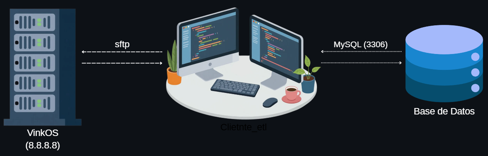
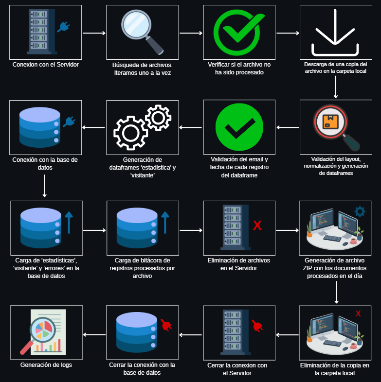
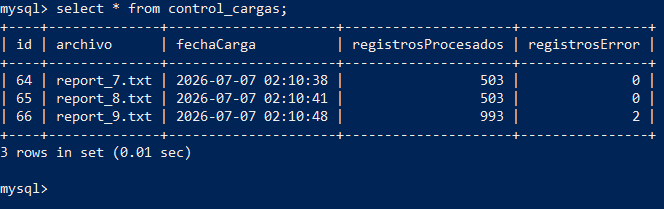
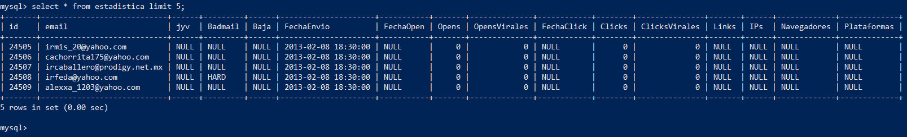
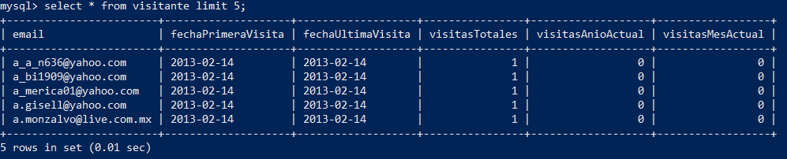
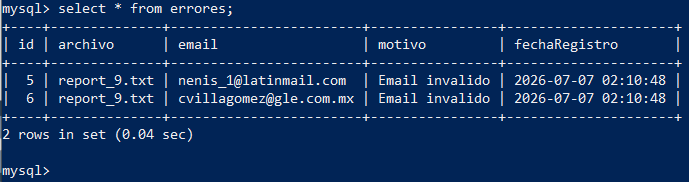

# ETL de Integración de Visitas Web

Proceso ETL desarrollado en **Python** para integrar la información de visitas de un sitio web almacenada en archivos planos ubicados en un servidor **SFTP**. El proyecto automatiza la extracción, validación, transformación y carga de la información en una base de datos **MySQL**, además de administrar el ciclo de vida completo de los archivos procesados.

---

# Arquitectura del sistema




---

# Objetivo

El objetivo del proyecto es construir un proceso ETL capaz de:

- Conectarse diariamente a un servidor remoto mediante SFTP.
- Detectar automáticamente nuevos archivos de visitas.
- Validar la estructura e información contenida en cada archivo.
- Transformar la información para cumplir las reglas de negocio.
- Cargar los datos en diferentes tablas MySQL.
- Mantener un control de archivos procesados.
- Generar respaldos comprimidos.
- Registrar la ejecución del proceso mediante una bitácora.

---

# Tecnologías utilizadas

- Python 3
- Docker
- Docker Compose
- Paramiko
- Pandas
- MySQL 8

---

# Estructura del proyecto

```text
Proyecto_ETL/

│
├── docker-compose.yml
│
├── etl/
│   ├── backup.py
│   ├── config.py
│   ├── database.py
│   ├── logger.py
│   ├── main.py
│   ├── parser.py
│   ├── sftp_client.py
│   ├── transformer.py
│   ├── validator.py
│   ├── requirements.txt
│   │
│   ├── backup/
│   ├── downloads/
│   └── logs/
│
├── mysql/
│   └── init.sql
│
└── sftp_server/
```

---

# Flujo de procesamiento




Cada ejecución del ETL sigue el siguiente flujo:

1. Conexión al servidor SFTP.
2. Búsqueda de archivos `report_*.txt`.
3. Verificación de archivos previamente procesados.
4. Descarga del archivo al servidor ETL.
5. Validación del layout.
6. Normalización de columnas.
7. Conversión del archivo a DataFrame.
8. Validación de emails.
9. Validación de fechas.
10. Transformación de la información.
11. Generación de los DataFrames destino.
12. Inserción de la tabla **estadística**.
13. Inserción / actualización de la tabla **visitante**.
14. Registro de errores encontrados.
15. Registro del archivo en la bitácora de control.
16. Eliminación del archivo en el servidor remoto.
17. Generación de un archivo ZIP con los archivos procesados.
18. Eliminación de las copias temporales.
19. Registro de la ejecución en la bitácora.

---

# Reglas de negocio implementadas

El proceso implementa las siguientes reglas:

- Sólo se procesan archivos cuyo nombre cumple el formato:

```
report_*.txt
```

- Un archivo nunca puede cargarse dos veces.

- El layout del archivo debe coincidir con la estructura esperada.

- El segundo campo del archivo puede variar (`jyv`, `jk`, `fgh`, etc.), pero internamente siempre es normalizado como **jyv**.

- Los emails son validados mediante el método *validate_email* que traemos de **email_validator**.

- Las fechas son validadas utilizando el formato:

```
dd/mm/yyyy HH:mm
```

- En la tabla **visitante** únicamente existe un registro por correo electrónico.

- Los registros inválidos son almacenados en la tabla **errores**.

- Después de una carga exitosa el archivo es eliminado del servidor remoto.

- Todos los archivos procesados durante la ejecución son comprimidos en un único archivo ZIP.

---

# Modelo de datos

El proyecto utiliza cuatro tablas principales:

## visitante

Contiene un registro único por cada visitante.

Campos principales:

- email
- fechaPrimeraVisita
- fechaUltimaVisita
- visitasTotales
- visitasAnioActual
- visitasMesActual

---

## estadistica

Almacena la información completa proveniente de cada visita.

---

## errores

Registra los registros que no pudieron ser cargados debido a errores de validación.

---

## control_cargas

Registra cada archivo procesado, junto con:

- fecha de carga
- registros procesados
- registros con error

---

# Ejecución

Construcción del proyecto:

```bash
docker compose build
```

Levantar los servicios:

```bash
docker compose up -d
```

Ejecutar el ETL:

```bash
docker compose run --rm etl
```

Detener el proyecto:

```bash
docker compose down
```

---

# Salida en los Logs (Resumida)

Para ver la salida completa, entre al archivo `etl\logs\etl_20260707.log`

```bash
 | INFO | Conexión a MySQL exitosa.
 | INFO | Conectando al servidor SFTP...
 | INFO | Connected (version 2.0, client OpenSSH_8.4p1)
 | INFO | Authentication (password) successful!
 | INFO | [chan 0] Opened sftp connection (server version 3)
 | INFO | Conexión establecida.
 | INFO | Buscando archivos...
 | INFO | 3 encontrados.
 | INFO | Procesando: report_7.txt
 | INFO | Archivo data/report_7.txt descargado.
 | INFO | Registros válidos : 503
 | INFO | Registros error   : 0
 | INFO | 503 registros insertados en estadistica.
 | INFO | Visitantes insertados : 502
 | INFO | Visitantes actualizados: 0
 | INFO | report_7.txt registrado en control_cargas.
 | INFO | Archivo remoto eliminado: data/report_7.txt.
 | INFO | Backup creado: backup/backup_20260707.zip
 | INFO | Archivo local eliminado: downloads/report_7.txt
 | INFO | Archivo local eliminado: downloads/report_8.txt
 | INFO | Archivo local eliminado: downloads/report_9.txt
 | INFO | [chan 0] sftp session closed.
 | INFO | Conexión cerrada.
 | INFO | Conexión cerrada.

```

---

# Características implementadas

- Conexión SFTP mediante Paramiko.
- Descarga automática de archivos.
- Validación del layout.
- Normalización automática de columnas.
- Validación de emails.
- Validación de fechas.
- Transformación de datos.
- Inserción en MySQL.
- Upsert de visitantes.
- Registro de errores.
- Bitácora de ejecución.
- Control de archivos procesados.
- Generación automática de respaldos ZIP.
- Eliminación automática de archivos procesados.

---
# Captura de pantallas de la Base de Datos








---

# Posibles mejoras

Como trabajo futuro podrían implementarse las siguientes mejoras:

- Configuración mediante variables de entorno (.env).
- Programación automática del ETL mediante cron.
- Pruebas unitarias.
- Integración continua (CI/CD).
- Notificaciones por correo electrónico ante fallos.
- Procesamiento paralelo de archivos.
- Integración con Hadoop (HDFS + Hive + Impala).
- Dashboard de monitoreo del proceso ETL.

---

# Autor

**Miguel Angel Monteros**

Proyecto desarrollado como prueba técnica para la implementación de un proceso ETL utilizando Python, Docker y MySQL.
